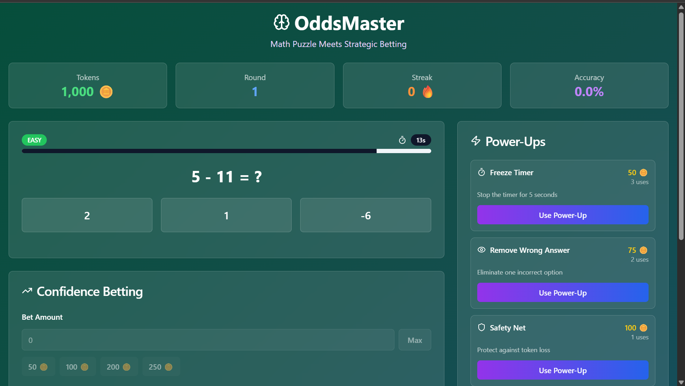
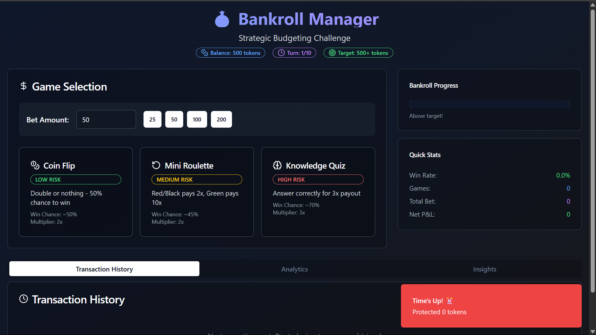

# 🎮 GameHub Trio – Interactive Web Game Collection

A collection of three interactive browser games—built to showcase engaging front-end logic, probability modeling, and responsive gameplay—all bundled into a single modern React project.

Built with:
🛠️ Vite • TypeScript • React • shadcn-ui • Tailwind CSS

---

## 🧩 Games Included

### 1. 🐆 Animal Racing Game (Home Page)

A betting-style racing simulator featuring randomized animal winners based on weighted probabilities.

- Choose your favorite animal (Lion, Cheetah, or Wolf)
- Place your bet and watch the simulated race
- Each animal has a hidden probability (e.g. Lion: 50%, Cheetah: 30%, Wolf: 20%)
- Track your virtual token balance as you play multiple rounds

🧠 Core Features:

- Weighted random selection logic
- Real-time UI updates on results
- Score management with responsive feedback

---

### 2. 🧠 OddsMaster – Math & Risk Challenge

Test your logic under pressure by solving math puzzles with a twist of confidence-based betting.

- Solve quick math problems under time constraints
- Bet tokens based on confidence in your answer
- Earn more by betting high—but lose more too!

🧠 Core Features:

- Risk-reward logic tied to mathematical confidence
- Countdown timer and animated feedback
- Dynamic scoring based on difficulty & bet amount

---

### 3. 💰 Bankroll Manager – Budgeting Strategy Game

A turn-based strategy simulation that challenges players to manage a bankroll across risk-tiered betting rounds.

- Start with 500 virtual tokens
- Choose from 3 risk levels: Safe (low reward), Balanced, or High Risk (big win or bust)
- Track your performance over 10 turns using live stats

📊 Core Features:

- Turn-based gameplay with state tracking
- Real-time token balance updates
- Integrated charts for performance analytics

---

## 🚀 Tech Stack

- ⚡ Vite – Fast build tool optimized for modern frontend
- 💬 React + TypeScript – Component-driven architecture with static typing
- 🎨 Tailwind CSS – Utility-first styling for responsive UI
- 🌿 shadcn-ui – Accessible, prebuilt UI components with headless behavior

---

## 📁 Project Structure (Simplified)

```
src/
├── components/
│   └── GameCard.tsx
├── pages/
│   ├── BankrollManager.tsx
│   ├── Index.tsx
│   └── NotFound.tsx
│   └── OddsMaster.tsx
├── assets/
│   └── images/
├── App.tsx
└── main.tsx
```

---

## 📸 Screenshots

1. 🦁 Animal Racing Game  
   

2. 🧠 OddsMaster  
   

3. 💰 Bankroll Manager  
   

---

## 🧪 How to Run Locally

```bash
git clone https://github.com/yourusername/gamehub-trio.git
cd gamehub-trio
npm install
npm run dev
```

Access the project at: [http://localhost:5173](http://localhost:5173)

---

## ✨ Features To Explore

- Game logic built on real-world probability and reward systems
- Fully responsive and mobile-friendly design
- Clean, scalable codebase built with modular React components

---

## 📌 Future Enhancements (Ideas)

- Add login and persistent scores via Firebase
- Integrate leaderboard functionality
- Deploy to Replit or GitHub Pages for live demo

---

## 🧑‍💻 Author

Made with curiosity & creativity by [Jescaps Antwi](https://www.linkedin.com/in/jescapsantwi/)
🔗 Portfolio: [jesantwi.vercel.app](https://jesantwi.vercel.app)
🔗 GitHub: [@JescapsAntwi](https://github.com/JescapsAntwi)
